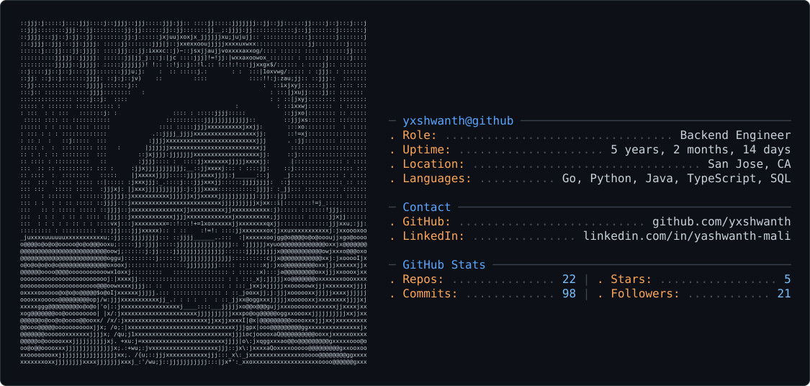

<picture>
  <source media="(prefers-color-scheme: dark)" srcset="dark_mode.svg" />
  <source media="(prefers-color-scheme: light)" srcset="light_mode.svg" />
  
</picture>

<pre>
yxshwanth@systems:~$ whoami
</pre>

**Backend engineer** building production systems in Go, Python, Java, and TypeScript.  
I care about the unglamorous parts — latency budgets, consistency edges, and what breaks at 10× traffic.

`MS CS @ CU Boulder` · `GPA 3.9` · `Open to full-time backend / systems roles`

<p align="left">
  <a href="mailto:me@yashwanthreddymali.com"></a>
  <a href="https://linkedin.com/in/yashwanth-mali"></a>
  <a href="https://github.com/yxshwanth"></a>
</p>

---

### lately

| | |
| :--- | :--- |
| **Credible Data** | Shipped Atlas backend — SSE chat, Malloy over Postgres/Neo4j/BigQuery; cut API P95 **1.2s → 480ms** |
| **Interlock** | eBPF + Go MCP firewall that stops AI agents from exfiltrating secrets |
| **Open source** | PRs in **Auth0 OpenFGA** & **Google Malloy** (incl. Check API consistency-token fix) |

---

### selected work

<table>
<tr>
<td width="50%" valign="top">

**[Interlock](https://github.com/yxshwanth/Interlock)**  
`Go` `eBPF` `Kubernetes`

Runtime exfiltration firewall for AI agents.  
MCP proxy + syscall tracing; ~0.5ms overhead on sensitive reads.

</td>
<td width="50%" valign="top">

**[Dispatch](https://github.com/yxshwanth/Dispatch)**  
`Go` `Kafka` `Postgres` `Redis`

Multi-tenant webhook delivery with honest circuit breakers.  
Ingest p99 **2.1ms** · delivery p99 **~2.5ms**

</td>
</tr>
<tr>
<td width="50%" valign="top">

**[Zenith](https://github.com/yxshwanth/zenith)**  
`Go` `CockroachDB` `gRPC`

Zanzibar-style ReBAC across 10K+ tenants.  
**sub-10ms P95** at **10K+ RPS** (k6)

</td>
<td width="50%" valign="top">

**[LineageGraph](https://github.com/yxshwanth/LineageGraph)**  
`Python` `LangGraph` `Postgres`

GraphRAG lineage with hallucination guards.  
Semantic search **&lt;200ms** · graph depth=3 **&lt;50ms**

</td>
</tr>
</table>

---

### stack

```text
languages    Go · Python · Java · TypeScript · Rust · SQL · C (eBPF)
systems      gRPC · Kafka · Redis · Postgres · CockroachDB · Neo4j
runtime      Kubernetes · Docker · AWS (EKS) · GCP (Cloud Run)
observe      OpenTelemetry · Prometheus · Grafana · Jaeger
security     eBPF · OAuth2 / JWT · HMAC · OCSF / SIEM
```

<p align="left">
  
  
  
  
  
  
  
  
</p>

---

### experience

**Software Engineer — Credible Data** · *Aug 2025 – May 2026* · Boulder, CO  
Built the Express/Node backend for an AI-native data-discovery platform (SSE streaming, Auth0/JWT gateway, custom MCP server). Tuned pools & indexes to cut production P95 by **60%**. GCP + GitHub Actions with health-check rollbacks.

**Software Engineer Intern — IntelleWings** · *Feb 2023 – Jun 2024* · FinTech  
Owned a Spring Boot transaction-monitoring path at **100K+/mo**, **sub-200ms**. Multi-tier Redis cache cut query latency **70%**; Jenkins/Docker/K8s cut release cycles from **5 days → 3**.

---

### signals

<p align="center">
  
  &nbsp;
  
</p>

---

<p align="center">
  <i>latency is a feature · consistency is a contract · tests name what they don't catch</i>
</p>

<p align="center">
  <a href="mailto:yashwanth.apply@gmail.com">email</a>
  ·
  <a href="https://linkedin.com/in/yashwanth-mali">linkedin</a>
  ·
  <a href="https://github.com/yxshwanth">github</a>
</p>
