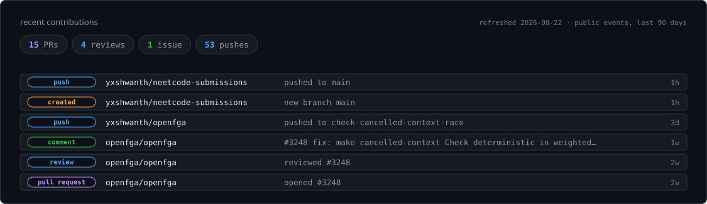
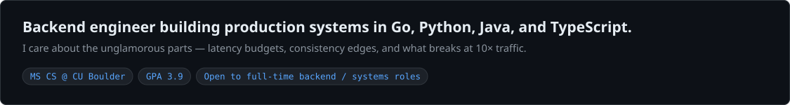
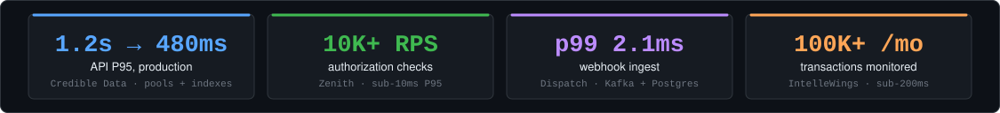
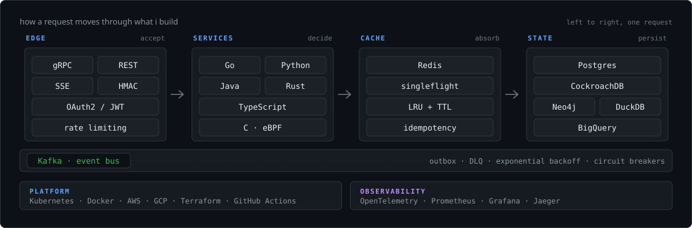
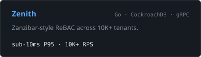
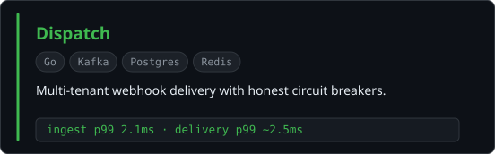
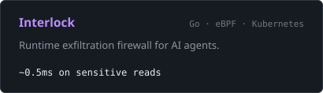
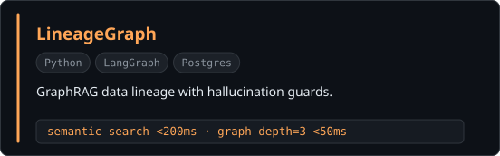
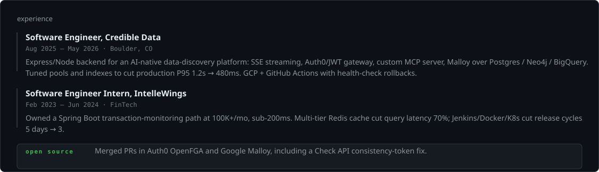

<picture>
  <source media="(prefers-color-scheme: dark)" srcset="dark_mode.svg" />
  <source media="(prefers-color-scheme: light)" srcset="light_mode.svg" />
  
</picture>

<picture>
  <source media="(prefers-color-scheme: dark)" srcset="assets/activity-dark.svg" />
  <source media="(prefers-color-scheme: light)" srcset="assets/activity-light.svg" />
  
</picture>

<picture>
  <source media="(prefers-color-scheme: dark)" srcset="assets/intro-dark.svg" />
  <source media="(prefers-color-scheme: light)" srcset="assets/intro-light.svg" />
  
</picture>

  <a href="mailto:me@yashwanthreddymali.com"><picture>
    <source media="(prefers-color-scheme: dark)" srcset="assets/btn-email-dark.svg" />
    <source media="(prefers-color-scheme: light)" srcset="assets/btn-email-light.svg" />
    
  </picture></a>
  <a href="https://linkedin.com/in/yashwanth-mali"><picture>
    <source media="(prefers-color-scheme: dark)" srcset="assets/btn-linkedin-dark.svg" />
    <source media="(prefers-color-scheme: light)" srcset="assets/btn-linkedin-light.svg" />
    
  </picture></a>
  <a href="https://github.com/yxshwanth"><picture>
    <source media="(prefers-color-scheme: dark)" srcset="assets/btn-github-dark.svg" />
    <source media="(prefers-color-scheme: light)" srcset="assets/btn-github-light.svg" />
    
  </picture></a>

<picture>
  <source media="(prefers-color-scheme: dark)" srcset="assets/impact-dark.svg" />
  <source media="(prefers-color-scheme: light)" srcset="assets/impact-light.svg" />
  
</picture>

<picture>
  <source media="(prefers-color-scheme: dark)" srcset="assets/stack-dark.svg" />
  <source media="(prefers-color-scheme: light)" srcset="assets/stack-light.svg" />
  
</picture>

<table>
<tr>
<td width="50%"><a href="https://github.com/yxshwanth/zenith"><picture>
  <source media="(prefers-color-scheme: dark)" srcset="assets/work-zenith-dark.svg" />
  <source media="(prefers-color-scheme: light)" srcset="assets/work-zenith-light.svg" />
  
</picture></a></td>
<td width="50%"><a href="https://github.com/yxshwanth/Dispatch"><picture>
  <source media="(prefers-color-scheme: dark)" srcset="assets/work-dispatch-dark.svg" />
  <source media="(prefers-color-scheme: light)" srcset="assets/work-dispatch-light.svg" />
  
</picture></a></td>
</tr>
<tr>
<td width="50%"><a href="https://github.com/yxshwanth/Interlock"><picture>
  <source media="(prefers-color-scheme: dark)" srcset="assets/work-interlock-dark.svg" />
  <source media="(prefers-color-scheme: light)" srcset="assets/work-interlock-light.svg" />
  
</picture></a></td>
<td width="50%"><a href="https://github.com/yxshwanth/LineageGraph"><picture>
  <source media="(prefers-color-scheme: dark)" srcset="assets/work-lineagegraph-dark.svg" />
  <source media="(prefers-color-scheme: light)" srcset="assets/work-lineagegraph-light.svg" />
  
</picture></a></td>
</tr>
</table>

<picture>
  <source media="(prefers-color-scheme: dark)" srcset="assets/experience-dark.svg" />
  <source media="(prefers-color-scheme: light)" srcset="assets/experience-light.svg" />
  
</picture>

<picture>
  <source media="(prefers-color-scheme: dark)" srcset="assets/footer-dark.svg" />
  <source media="(prefers-color-scheme: light)" srcset="assets/footer-light.svg" />
  
</picture>
