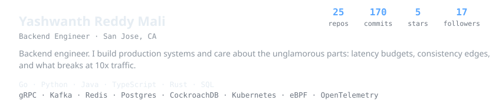
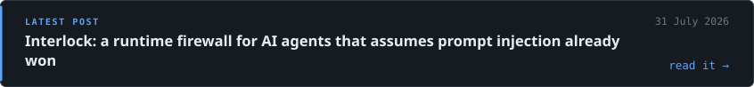
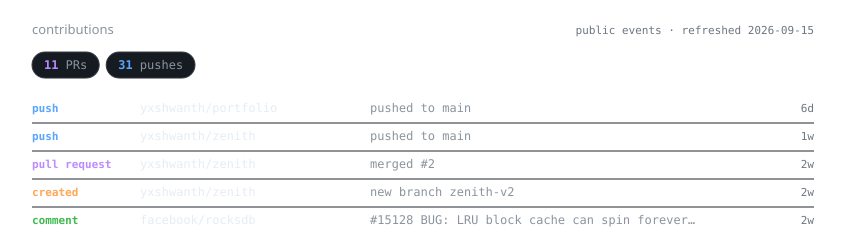

<picture>
  <source media="(prefers-color-scheme: dark)" srcset="assets/header-dark.svg" />
  <source media="(prefers-color-scheme: light)" srcset="assets/header-light.svg" />
  
</picture>

  <a href="https://yashwanthreddymali.com/blog/"><picture>
    <source media="(prefers-color-scheme: dark)" srcset="assets/btn-blog-dark.svg" />
    <source media="(prefers-color-scheme: light)" srcset="assets/btn-blog-light.svg" />
    
  </picture></a>
  <a href="mailto:me@yashwanthreddymali.com"><picture>
    <source media="(prefers-color-scheme: dark)" srcset="assets/btn-email-dark.svg" />
    <source media="(prefers-color-scheme: light)" srcset="assets/btn-email-light.svg" />
    
  </picture></a>
  <a href="https://linkedin.com/in/yashwanth-mali"><picture>
    <source media="(prefers-color-scheme: dark)" srcset="assets/btn-linkedin-dark.svg" />
    <source media="(prefers-color-scheme: light)" srcset="assets/btn-linkedin-light.svg" />
    
  </picture></a>

<a href="https://yashwanthreddymali.com/blog/interlock-exfiltration-at-runtime/">
  <picture>
    <source media="(prefers-color-scheme: dark)" srcset="assets/latest-dark.svg" />
    <source media="(prefers-color-scheme: light)" srcset="assets/latest-light.svg" />
    
  </picture>
</a>

<picture>
  <source media="(prefers-color-scheme: dark)" srcset="assets/contributions-dark.svg" />
  <source media="(prefers-color-scheme: light)" srcset="assets/contributions-light.svg" />
  
</picture>

<table>
<tr>
<td width="50%"><a href="https://github.com/yxshwanth/zenith">
  <picture>
    <source media="(prefers-color-scheme: dark)" srcset="assets/work-zenith-dark.svg" />
    <source media="(prefers-color-scheme: light)" srcset="assets/work-zenith-light.svg" />
    
  </picture>
</a></td>
<td width="50%"><a href="https://github.com/yxshwanth/Dispatch">
  <picture>
    <source media="(prefers-color-scheme: dark)" srcset="assets/work-dispatch-dark.svg" />
    <source media="(prefers-color-scheme: light)" srcset="assets/work-dispatch-light.svg" />
    
  </picture>
</a></td>
</tr>
<tr>
<td width="50%"><a href="https://github.com/yxshwanth/Interlock">
  <picture>
    <source media="(prefers-color-scheme: dark)" srcset="assets/work-interlock-dark.svg" />
    <source media="(prefers-color-scheme: light)" srcset="assets/work-interlock-light.svg" />
    
  </picture>
</a></td>
<td width="50%"><a href="https://github.com/yxshwanth/LineageGraph">
  <picture>
    <source media="(prefers-color-scheme: dark)" srcset="assets/work-lineagegraph-dark.svg" />
    <source media="(prefers-color-scheme: light)" srcset="assets/work-lineagegraph-light.svg" />
    
  </picture>
</a></td>
</tr>
</table>
